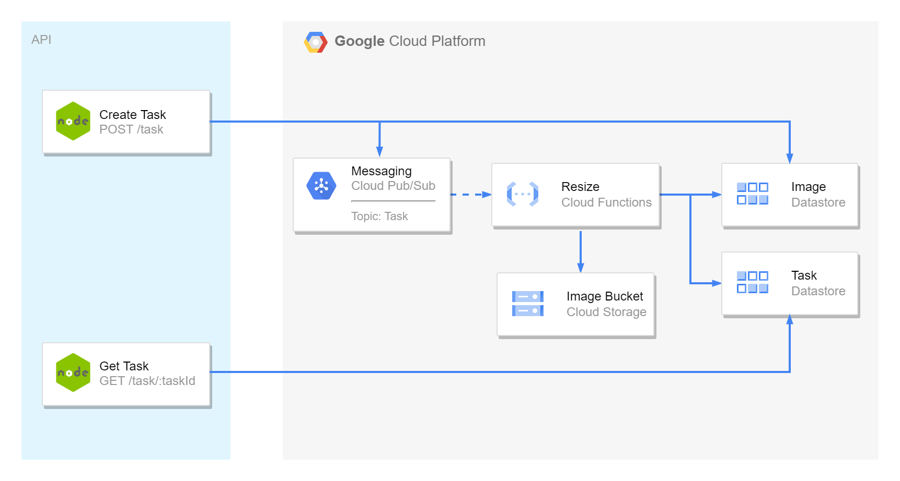

# ResizeFunction
Serverless function to create a task to resize an image.

**Autor:** Brenda Costa

## Pre-Requisites
To use this base project, you must have installed:
- nodejs
- npm
- gcloud CLI

Javascript libraries must be install using `npm install` before start app. 

## Architecture
There is a single graph that shows how components work together below:



## API Endpoints and Function
This project contains 2 API endpoints:
- **Tasks** (/tasks): Create task request. It receives the original image path.
- **Task Status** (/tasks/taskId): Get a task status.
These methods are implemented in app.js.

There is also a cloud function:
- **Resize:** This function is triggered by new messages in Tasks PubSub.

## Cloud Resources
Cloud function was coded to be deployed in GCP. There are resources that have to be created in cloud:

### PubSub
It is neccessary to create one topic: tasks.

### Datastore
Two Kinds were created in Datastore. Images for image details and Tasks for tasks registry.

### Bucket
One bucket is create to store images and thumbnails.

## Get Started
After clone repository, you can run the API locally with:

```
node app.js
```

To deploy Cloud Function **resize**, use command below:

```
cloud functions deploy resize --runtime nodejs14 --trigger-topic tasks
```